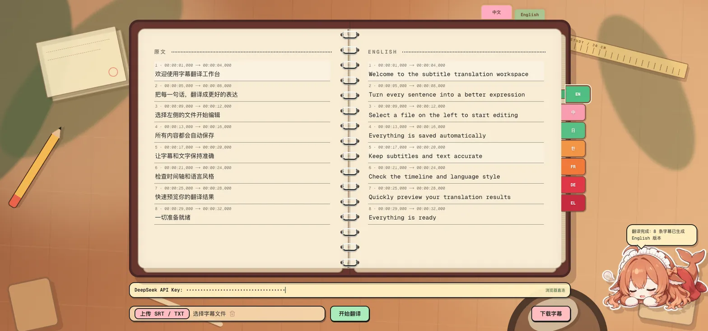

# Subtitle Translate

一个基于 Next.js、React、Tailwind CSS 和 shadcn/ui 的字幕翻译工作台。支持导入字幕、选择目标语言、在浏览器中调用 DeepSeek 翻译，并导出翻译后的字幕文件。

本项目支持以静态站点形式部署到 GitHub Pages。

## 预览



## 功能

- 导入 `.srt` 和 `.txt` 字幕文件
- 保留 SRT 时间轴并编辑原文与译文
- 支持 English、中文、日本語、한국어、Français、Deutsch、Ελληνικά
- 中文 / English 界面切换
- 使用 DeepSeek 生成字幕翻译（浏览器直连）
- 自动保存当前工作区
- 导出 `.srt` 或 `.txt` 文件
- 浏览器内输入 DeepSeek API Key，不写入项目文件

## 技术栈

- Next.js 16
- React 19
- TypeScript
- Tailwind CSS 4
- shadcn/ui
- Bun
- Turborepo

## 开始运行

### 环境要求

- Node.js 20 或更高版本
- Bun 1.4 或更高版本

### 安装依赖

```bash
bun install
```

### 启动开发服务器

```bash
bun run dev
```

打开 [http://localhost:3000](http://localhost:3000)。

点击“开始翻译”前，需要在页面的 `DeepSeek API Key` 输入框中填写 API Key。未填写时，应用会阻止请求并提示补充 API Key。

## 常用命令

```bash
bun run dev        # 启动所有开发服务
bun run build      # 构建项目
bun run typecheck  # TypeScript 类型检查
bun run lint       # ESLint 检查
bun run format     # 格式化代码
```

## 项目结构

```text
apps/web/
├── app/
│   ├── page.tsx        # 字幕翻译工作台
│   └── layout.tsx      # 应用布局
├── public/
│   └── preview.webp    # README 预览图
└── package.json

packages/ui/             # 共享 shadcn/ui 组件与样式
```

## 部署到 GitHub Pages

推送到 `main` 后，`.github/workflows/deploy-pages.yml` 会自动构建并发布静态站点。

首次启用时，在仓库的 **Settings → Pages → Build and deployment** 中将 **Source** 设置为 **GitHub Actions**。

默认项目站点地址：<https://twor.github.io/Subtitle-Translate/>。如果仓库配置了自定义域名，请以 **Settings → Pages** 中显示的地址为准。

GitHub Pages 只能托管静态文件，因此翻译功能使用页面中的 DeepSeek API Key 从浏览器直连 DeepSeek。API Key 仅保存在当前浏览器会话中，不会写入仓库或构建产物。
